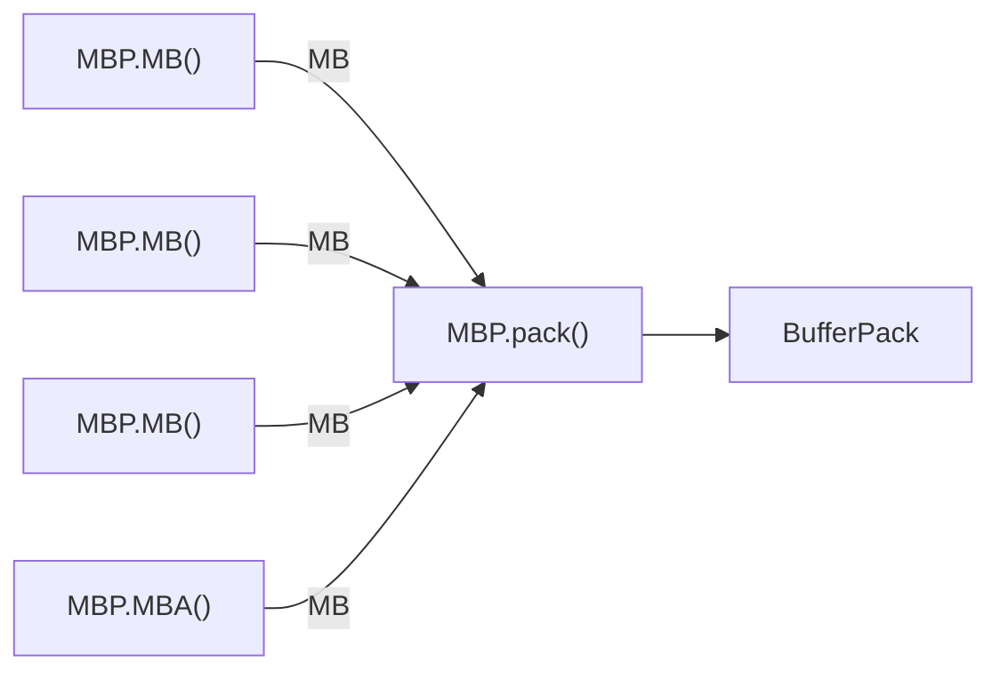
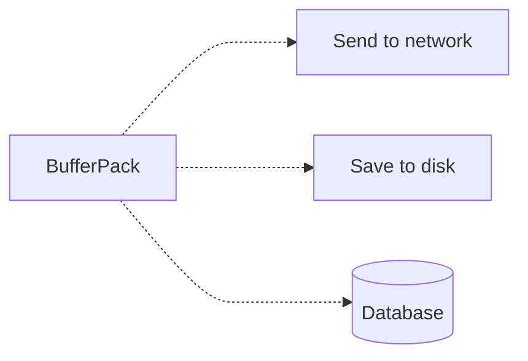
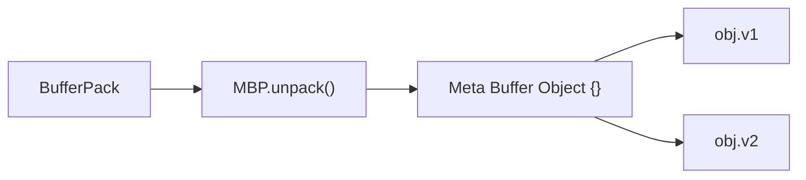

# pack and unpack 

data processing

## FlowChart

```mermaid

flowchart LR
    MB1["MBP.MB()"]--MB-->C["MBP.pack()"]
    MB2["MBP.MB()"]--MB-->C
    MB3["MBP.MB()"]--MB-->C
    MBA["MBP.MBA()"]--MB-->C

    C-->D["BufferPack"]
```

* bufferPack is a Buffer (subclasss of Uint8Array)

```mermaid
flowchart LR

    D["BufferPack"]
    D-..->N[Send to network]
    D-..->F[Save to disk]
    D-..->DB[(Database)]
    

```

```mermaid
flowchart LR

    D["BufferPack"]
    D-->U["MBP.unpack()"]
    U-->O["Meta Buffer Object {}"]
    O-->V1["obj.v1"]
    O-->V2["obj.v2"]

```
